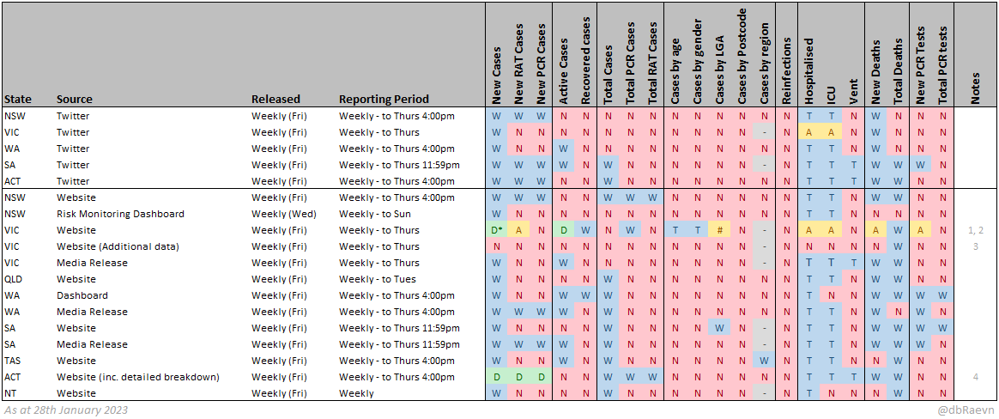
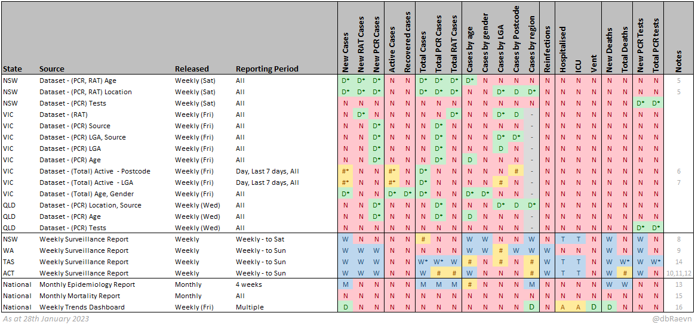
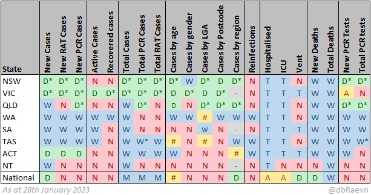

# Official COVID-19 data sources

< [Back](README.md)

## Data sources

 * NSW	[Twitter](https://twitter.com/NSWHealth)
 * VIC	[Twitter](https://twitter.com/VicGovDH)
 * WA	[Twitter](https://twitter.com/MarkMcGowanMP)
 * SA	[Twitter](https://twitter.com/SAHealth)
 * ACT	[Twitter](https://twitter.com/ACTHealth)
 * NSW	[Website](https://www.health.nsw.gov.au/Infectious/covid-19/Pages/stats-nsw.aspx)
 * NSW	[Risk Monitoring Dashboard](https://aci.health.nsw.gov.au/covid-19/critical-intelligence-unit/dashboard)
 * VIC	[Website](https://www.coronavirus.vic.gov.au/victorian-coronavirus-covid-19-data)
 * VIC	[Website (Additional data)](https://www.coronavirus.vic.gov.au/victorian-coronavirus-covid-19-data)
 * VIC	[Media Release](https://www.health.vic.gov.au/media-centre/media-releases)
 * QLD	[Website](https://www.qld.gov.au/health/conditions/health-alerts/coronavirus-covid-19/queensland-covid-19-statistics)
 * WA	[Dashboard](https://experience.arcgis.com/experience/359bca83a1264e3fb8d3b6f0a028d768)
 * WA	[Media Release](https://ww2.health.wa.gov.au/News/Media-releases-listing-page)
 * SA	[Website](https://www.sahealth.sa.gov.au/wps/wcm/connect/public+content/sa+health+internet/conditions/infectious+diseases/covid-19/response/latest+updates/covid-19+dashboard)
 * SA	[Media Release](https://www.sahealth.sa.gov.au/wps/wcm/connect/public+content/sa+health+internet/about+us/news+and+media/all+media+releases?mr-sort=date-desc&mr-pg=1)
 * TAS	[Website](https://www.coronavirus.tas.gov.au/facts/tasmanian-statistics)
 * ACT	[Website (inc. detailed breakdown)](https://www.covid19.act.gov.au/updates/act-covid-19-statistics)
 * NT	[Website](https://health.nt.gov.au/covid-19/data)
 * NSW	[Dataset - (PCR, RAT) Age](https://data.nsw.gov.au/data/dataset/nsw-covid-19-cases-by-age-range/resource/4b03bc25-ab4b-46c0-bb3e-0c839c9915c5)
 * NSW	[Dataset - (PCR, RAT) Location](https://data.nsw.gov.au/data/dataset/covid-19-cases-by-location/resource/5d63b527-e2b8-4c42-ad6f-677f14433520)
 * NSW	[Dataset - (PCR) Tests](https://data.nsw.gov.au/data/dataset/nsw-covid-19-tests-by-location/resource/fb95de01-ad82-4716-ab9a-e15cf2c78556)
 * VIC	[Dataset - (RAT)](https://discover.data.vic.gov.au/dataset/all-victorian-rat-sars-cov-2-cases-by-local-government-area-postcode/resource/a7c149f8-4ad3-4768-84b3-477a054f80bb)
 * VIC	[Dataset - (PCR) Source](https://discover.data.vic.gov.au/dataset/all-victorian-sars-cov-2cases-by-acquired-source/resource/d35dd0fb-5288-4194-8f77-373e2b2cc44d)
 * VIC	[Dataset - (PCR) LGA, Source](https://discover.data.vic.gov.au/dataset/all-victorian-sars-cov-2-cases-by-local-government-area-postcode-and-acquired-source/resource/890da9b3-0976-4de3-8028-e0c22b9a0e09)
 * VIC	[Dataset - (PCR) LGA](https://discover.data.vic.gov.au/dataset/all-victorian-sars-cov-2-cases-by-local-government-area/resource/cc6d89f4-046c-4486-b4a9-63a58fcf9785)
 * VIC	[Dataset - (PCR) Age](https://discover.data.vic.gov.au/dataset/all-victorian-sars-cov-2-cases-by-age-group/resource/b98245c0-f42c-4df8-bced-62f5bcde67f6)
 * VIC	[Dataset - (Total) Active  - Postcode](https://docs.google.com/spreadsheets/d/e/2PACX-1vTwXSqlP56q78lZKxc092o6UuIyi7VqOIQj6RM4QmlVPgtJZfbgzv0a3X7wQQkhNu8MFolhVwMy4VnF/pub?gid=0&single=true&output=csv)
 * VIC	[Dataset - (Total) Active  - LGA](https://docs.google.com/spreadsheets/d/e/2PACX-1vQ9oKYNQhJ6v85dQ9qsybfMfc-eaJ9oKVDZKx-VGUr6szNoTbvsLTzpEaJ3oW_LZTklZbz70hDBUt-d/pub?gid=0&single=true&output=csv)
 * VIC	[Dataset - (Total) Age, Gender](https://public.tableau.com/views/GenderAgeGroup/CasesDashboard?%3Alanguage=en-US&%3Aembed=y&%3Aembed_code_version=3&%3AloadOrderID=4&%3Adisplay_count=y&publish=yes&%3Aorigin=viz_share_link&%3Asize=1056%2C25&&%3AshowVizHome=n&%3Atabs=n&%3AapiID=host2#navType=1&navSrc=Parse) (1)
 * QLD	[Dataset - (PCR) Location, Source](https://www.data.qld.gov.au/dataset/queensland-covid-19-case-line-list-location-source-of-infection)
 * QLD	[Dataset - (PCR) Age](https://www.data.qld.gov.au/dataset/queensland-covid-19-case-line-list-age-groups)
 * QLD	[Dataset - (PCR) Tests](https://www.data.qld.gov.au/dataset/queensland-covid-19-pathology-testing-totals)
 * NSW	[Weekly Surveillance Report](https://www.health.nsw.gov.au/Infectious/covid-19/Pages/weekly-reports.aspx)
 * WA	[Weekly Surveillance Report](https://ww2.health.wa.gov.au/Articles/F_I/Infectious-disease-data/COVID19-Weekly-Surveillance-Report)
 * TAS	[Weekly Surveillance Report](https://www.coronavirus.tas.gov.au/facts/tasmanian-statistics/weekly-report)
 * ACT	[Weekly Surveillance Report](https://www.covid19.act.gov.au/updates/act-covid-19-statistics)
 * National	[Monthly Epidemiology Report](https://www1.health.gov.au/internet/main/publishing.nsf/Content/novel_coronavirus_2019_ncov_weekly_epidemiology_reports_australia_2020.htm)
 * National	[Monthly Mortality Report](https://www.abs.gov.au/statistics/health/causes-death/related-articles)
 * National	[Weekly Trends Dashboard](https://www.health.gov.au/health-alerts/covid-19/case-numbers-and-statistics) (2)

(1) To download this dataset, select then deselect an age group. This will enabled the "Data" option under downloads, allowing the dataset to be downloaded as a csv.

(2) Use the following javascript bookmark to show the datatables on this page:  
```javascript:(function () {document.querySelectorAll('[id^="hc-linkto-highcharts-data-table-"]').forEach(button=>button.click())})()```

**Additional Data sources:**  

These do not appear in the tables as they provide different kinds of data, but are otherwise useful information sources:

 * NSW	[Weekly sewage surveillance](https://www.health.nsw.gov.au/Infectious/covid-19/Pages/sewage-surveillance-weekly-result.aspx)
 * National	[Weekly common operating picture](https://www.health.gov.au/resources/collections/coronavirus-covid-19-common-operating-picture)
 * National	[Weekly outbreaks in Australian residential aged care facilities report](https://www.health.gov.au/resources/collections/covid-19-outbreaks-in-australian-residential-aged-care-facilities)
 
**Legend:**  
🔵W = Weekly  
🔵M = Monthly  
🔵T = Total (available weekly)  
🟢D = Daily  
🟡A = Daily average over last 7 days  
🟡# = Mixed/complex  
🔴N = Not available  
⚪- = Not applicable

\* Can be calculated or derived from other data in the same source

 * There may be nuances and/or caveats to the data that aren't indicated.
 * Additional metrics may be capturable by comparing week-on-week or day-on-day data (eg., cumulative totals).
 * Surveillance reports and vaccination data are not yet included.

### Information available by data source

This table shows the available information that can be obtained from each official data source.





**Notes:**
1. Daily, weekly and total cases available by LGA via the map
2. Weekly total cases provided as a figure, but chart contains daily new cases
3. Contains a breakdown of deaths by age group
4. Active cases provided as PCR/RAT/Total
5. NSW Datasets are missing 180,433 RAT cases recorded between 12-19 January 2022
6. Contains 1 day, weekly and total active cases by postcode
7. Contains 1 day, weekly and total active cases by LGA
8. Total cases only provided for 2022
9. Cases by LGA provided as a rate per 100,000 population
10. Total PCR and RAT cases only provided for 2022
11. Total cases by SA3 Region only provided since 2022
12. Total deaths only provided since 2022
13. Cases by age provided as a rate per 100,000 population
14.	Totals since 15th December 2021
15.	Report includes breakdowns of deaths by age and sex, state, detail of cause
16.	Some information requires accessing raw data tables

**Changelog:**

 - **30/09/2022**
   - Added datasource *TAS - Weekly Surveillance Report*
     - Weekly data for TAS now available for the following: New RAT & PCR cases, total RAT & PCR cases, cases by age and LGA since December 15th 2021, reinfections, deaths, new PCR tests, total PCR tests
   - Removed datasource *National - Weekly Trends Report (no longer exists)*
   - Updated datasource *National - Weekly Trends Dashboard (raw data now accessible)*
     - National new cases, new deaths interval now daily (was 7-day average)
 - **14/10/2022**
   - Update datasource *ACT - Website*
	 - Daily data now available for the following: New cases, New RAT cases, New PCR cases, Active cases
 - **29/10/2022**
   - Update datasource *ACT - Twitter*
	 - Active cases no longer reported
   - Update datasource *ACT - Website*
	 - Active cases no longer reported
 - **30/10/2022**
   - Added datasource *NSW - Dataset - (PCR) Tests*
	 - Daily data now available for New & Total PCR tests
   - Updated datasource *WA - Dashboard*
	 - Cases by age and Cases by gender no longer reported
   - Added datasource *National - Monthly Mortality Report*
 - **31/10/2022**
   - Added datasource *NSW - Weekly sewage surveillance*
 - **12/11/2022**
   - Added datasource *NSW - Risk Monitoring Dashboard*
 - **17/12/2022**
   - Added datasource *National - Weekly common operating picture*
   - Added datasource *National - Weekly outbreaks in Australian residential aged care facilities report*
 - **15/01/2023**
   - Removed datasource *VIC - Website (Daily)*
   - Removed datasource *QLD - Twitter*
   - Updated datasource *VIC - Media Release*
	 - Includes actual values for in-hospital and in-ICU, rather than just 7-day averages
   - Updated datasource *National - Weekly Trends Dashboard*
	 - Several changes based on availability of underlying data tables
 - **28/01/2023**
   - Added datasource *SA - Website*
   - Added datasource *QLD - Dataset - (PCR) Age*
   - Added datasource *QLD - Dataset - (PCR) Tests*

### Information Available by state

This table shows the sum of available data for each state across all the sources, at the highest frequency available.

