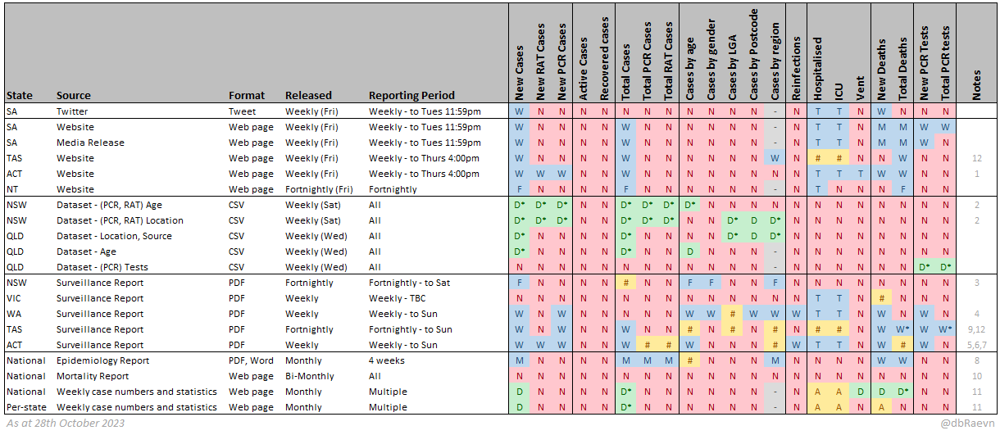
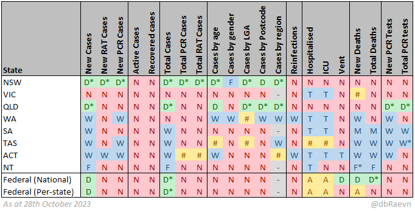

# Official COVID-19 data sources

< [Back](README.md)

## Data sources

 * SA	[Twitter](https://twitter.com/SAHealth)
 * SA	[Website](https://www.sahealth.sa.gov.au/wps/wcm/connect/public+content/sa+health+internet/conditions/infectious+diseases/covid-19/response/latest+updates/covid-19+dashboard)
 * SA	[Media Release](https://www.sahealth.sa.gov.au/wps/wcm/connect/public+content/sa+health+internet/about+us/news+and+media/all+media+releases?mr-sort=date-desc&mr-pg=1)
 * TAS	[Website](https://www.coronavirus.tas.gov.au/facts/tasmanian-statistics)
 * ACT	[Website](https://www.covid19.act.gov.au/updates/act-covid-19-statistics)
 * NT	[Website](https://health.nt.gov.au/covid-19/data)
 * NSW	[Dataset - (PCR, RAT) Age](https://data.nsw.gov.au/data/dataset/nsw-covid-19-cases-by-age-range/resource/4b03bc25-ab4b-46c0-bb3e-0c839c9915c5)
 * NSW	[Dataset - (PCR, RAT) Location](https://data.nsw.gov.au/data/dataset/covid-19-cases-by-location/resource/5d63b527-e2b8-4c42-ad6f-677f14433520)
 * QLD	[Dataset - Location, Source](https://www.data.qld.gov.au/dataset/queensland-covid-19-case-line-list-location-source-of-infection)
 * QLD	[Dataset - Age](https://www.data.qld.gov.au/dataset/queensland-covid-19-case-line-list-age-groups)
 * QLD	[Dataset - (PCR) Tests](https://www.data.qld.gov.au/dataset/queensland-covid-19-pathology-testing-totals)
 * NSW	[Surveillance Report](https://www.health.nsw.gov.au/Infectious/covid-19/Pages/weekly-reports.aspx)
 * VIC	[Surveillance Report](https://www.health.vic.gov.au/infectious-diseases/victorian-covid-19-surveillance-report)
 * WA	[Weekly Surveillance Report](https://ww2.health.wa.gov.au/Articles/F_I/Infectious-disease-data/COVID19-Weekly-Surveillance-Report)
 * TAS	[Surveillance Report](https://www.coronavirus.tas.gov.au/facts/tasmanian-statistics/weekly-report)
 * ACT	[Surveillance Report](https://www.covid19.act.gov.au/updates/act-covid-19-statistics)
 * National	[Epidemiology Report](https://www1.health.gov.au/internet/main/publishing.nsf/Content/novel_coronavirus_2019_ncov_weekly_epidemiology_reports_australia_2020.htm)
 * National	[Mortality Report](https://www.abs.gov.au/statistics/health/causes-death/related-articles)
 * National	[Weekly case numbers and statistics](https://www.health.gov.au/health-alerts/covid-19/case-numbers-and-statistics) (1)

(1) Use the following javascript bookmark to show the datatables on this page:  
```javascript:(function () {document.querySelectorAll('[id^="hc-linkto-highcharts-data-table-"]').forEach(button=>button.click())})()```

**Additional Data sources:**  

These do not appear in the tables as they provide different kinds of data, but are otherwise useful information sources:

 * National	[Weekly outbreaks in Australian residential aged care facilities report](https://www.health.gov.au/resources/collections/covid-19-outbreaks-in-australian-residential-aged-care-facilities)
 
**Legend:**  
🔵W = Weekly  
🔵F = Fortnightly  
🔵M = Monthly  
🔵T = Total (available weekly)  
🟢D = Daily  
🟡A = Daily average over last 7 days  
🟡# = Mixed/complex  
🔴N = Not available  
⚪- = Not applicable

\* Can be calculated or derived from other data in the same source

 * There may be nuances and/or caveats to the data that aren't indicated.
 * Additional metrics may be capturable by comparing week-on-week or day-on-day data (eg., cumulative totals).
 * Vaccination data is not included.

### Information available by data source

This table shows the available information that can be obtained from each official data source.



**Notes:**
1. Active cases provided as PCR/RAT/Total
2. NSW Datasets are missing 180,433 RAT cases recorded between 12-19 January 2022
3. Total cases only provided for 2022
4. Cases by LGA provided as a rate per 100,000 population
5. Total PCR and RAT cases only provided for 2022
6. Total cases by SA3 Region only provided since 2022
7. Total deaths only provided since 2022
8. Cases by age provided as a rate per 100,000 population
9. Totals since 15th December 2021
10. Report includes breakdowns of deaths by age and sex, state, detail of cause
11. Some information requires accessing raw data tables
12. TAS only provides new admissions for hospital and ICU, not in-Hospital and in-ICU numbers

**Changelog:**

 - **30/09/2022**
   - Added datasource *TAS - Weekly Surveillance Report*
     - Weekly data for TAS now available for the following: New RAT & PCR cases, total RAT & PCR cases, cases by age and LGA since December 15th 2021, reinfections, deaths, new PCR tests, total PCR tests
   - Removed datasource *National - Weekly Trends Report (no longer exists)*
   - Updated datasource *National - Weekly Trends Dashboard (raw data now accessible)*
     - National new cases, new deaths interval now daily (was 7-day average)
 - **14/10/2022**
   - Update datasource *ACT - Website*
	 - Daily data now available for the following: New cases, New RAT cases, New PCR cases, Active cases
 - **29/10/2022**
   - Update datasource *ACT - Twitter*
	 - Active cases no longer reported
   - Update datasource *ACT - Website*
	 - Active cases no longer reported
 - **30/10/2022**
   - Added datasource *NSW - Dataset - (PCR) Tests*
	 - Daily data now available for New & Total PCR tests
   - Updated datasource *WA - Dashboard*
	 - Cases by age and Cases by gender no longer reported
   - Added datasource *National - Monthly Mortality Report*
 - **31/10/2022**
   - Added datasource *NSW - Weekly sewage surveillance*
 - **12/11/2022**
   - Added datasource *NSW - Risk Monitoring Dashboard*
 - **17/12/2022**
   - Added datasource *National - Weekly common operating picture*
   - Added datasource *National - Weekly outbreaks in Australian residential aged care facilities report*
 - **15/01/2023**
   - Removed datasource *VIC - Website (Daily)*
   - Removed datasource *QLD - Twitter*
   - Updated datasource *VIC - Media Release*
	 - Includes actual values for in-hospital and in-ICU, rather than just 7-day averages
   - Updated datasource *National - Weekly Trends Dashboard*
	 - Several changes based on availability of underlying data tables
 - **28/01/2023**
   - Added datasource *SA - Website*
   - Added datasource *QLD - Dataset - (PCR) Age*
   - Added datasource *QLD - Dataset - (PCR) Tests*
 - **18/02/2023**
   - Removed datasource *WA - Dashboard*
   - Removed datasource *NSW - Dataset - (PCR) Tests*
   - Updated datasource *NSW - Surveillance Report*
	 - PCR testing information no longer provided
   - Updated datasource *TAS - Website*
	 - Hospital data now based on admissions
   - Updated datasource *TAS - Surveillance Report*
	 - Hospital data now based on admissions
	 - Frequency now fortnightly
 - **01/04/2023**
   - Removed datasource *ACT - Twitter*
   - Removed datasource *WA - Twitter*
   - Updated datasource *ACT - Website*
	 - Daily case breakdown no longer provided
	 - PCR and RAT total cases no longer provided
   - Updated datasource *SA - Website*
	 - Hospitalised, ICU and Vent no longer provided
 - **23/04/2023**
   - Removed datasource *VIC - Dataset - (RAT)*
   - Removed datasource *VIC - Dataset - (PCR) Source*
   - Removed datasource *VIC - Dataset - (PCR) LGA, Source*
   - Removed datasource *VIC - Dataset - (PCR) LGA*
   - Removed datasource *VIC - Dataset - (PCR) Age*
   - Added datasource *VIC - Dataset - (PCR, RAT) Age*
   - Added datasource *VIC - Dataset - (PCR, RAT) Location*
 - **12/05/2023**
   - Removed datasource  *QLD - Website*
   - Removed datasource  *QLD - Dataset - (PCR) Location, Source*
   - Removed datasource  *QLD - Dataset - (PCR) Age*
   - Removed datasource  *QLD - Dataset - (PCR) Tests*
   - Updated datasource *NSW - Surveillance Report*
	 -  Hospitalised, ICU and new Deaths no longer provided
 - **27/05/2023**
   - Reinstated datasource  *QLD - Dataset - Location, Source*
   - Reinstated datasource  *QLD - Dataset - Age*
   - Reinstated datasource  *QLD - Dataset - (PCR) Tests*
   - Added datasource *QLD - Surveillance Report*
   - Separated datasource "Weekly case numbers and statistics" into National / Per-state data
 - **09/07/2023**
   - Updated datasource  *VIC - Dataset - (PCR, RAT) Age*
	 -  VIC no longer collecting RAT cases
   - Updated datasource  *VIC - Dataset - (PCR, RAT) Location*
	 -  VIC no longer collecting RAT cases
   - Updated datasource  *VIC - Website*
	 -  Removed New RAT Cases
   - Updated datasource  *TAS - Surveillance Report*
	 -  Removed Reinfections
   - Updated datasource  *Mortality Report*
	 -  Frequency changed to Bi-Monthly
 - **29/07/2023**
   - Removed datasource  *VIC - Twitter*
   - Removed datasource  *VIC - Media Release*
   - Updated datasource  *SA - Twitter*
	 -  Reporting period updated
	 -  New RAT Cases, New PCR Cases, Active Cases, Total Cases, Vent, Total Deaths, New PCR Tests no longer reported
   - Updated datasource  *SA - Website*
	 -  Reporting period updated
	 -  Cases by LGA no longer reported
   - Updated datasource  *SA - Media Release*
	 -  Reporting period updated
	 -  New RAT Cases, New PCR Cases, Active Cases no longer reported
 - **24/09/2023**
   - Removed datasource  *VIC - Website*
   - Removed datasource  *VIC - Website (Additional data)*
   - Removed datasource  *VIC - Dataset - (PCR, RAT) Age*
   - Removed datasource  *VIC - Dataset - (PCR, RAT) Location*
   - Removed datasource  *VIC - Dataset - (Total) Active  - Postcode*
   - Removed datasource  *VIC - Dataset - (Total) Active  - LGA*
   - Removed datasource  *VIC - Dataset - (Total) Age, Gender*
   - Added datasource  *VIC - Surveillance Report*
   - Updated datasource NSW - Risk Monitoring Dashboard
	 -  Reporting period updated (now fortnightly)
   - Removed datasource WA - Media Release
   - Updated datasource NT - Website
	 -  Release cycle and reporting period updated (now fortnightly)
   - Updated datasource TAS - Website
	 -  Active cases no longer reported
 - **28/10/2023**
   - Removed datasource *NSW - Twitter*
   - Removed datasource *NSW - Website*
   - Removed datasource *NSW - Risk Monitoring Dashboard*
   - Updated datasource *NSW - Surveillance Report*
	 -  Release cycle and reporting period updated (now fortnightly)
   - Removed datasource *QLD - Surveillance report*
   - Updated datasource *WA - Surveillance Report*
	 -  Only PCR cases are included
   - Updated datasource *SA - Media Release*
	 -  Deaths are now reported monthly
   - Updated datasource *SA - Website*
	 -  Deaths are now reported monthly
   - Updated datasource *TAS - Surveillance Report*
	 -  Only PCR cases are reported, total cases by PCR/RAT no longer provided
   - Updated datasource *National/per-state - Case numbers and statistics*
	 -  Release cycle updated (now monthly)

### Information Available by state

This table shows the sum of available data for each state across all the sources, at the highest frequency available.

