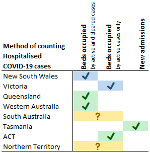

# Official COVID-19 data definitions

< [Back](README.md)

## Hospitalised Cases

Different states and territories use different definitions when reporting "Hospitalised cases". This page outlines the definitions used in state-based reporting.
Some states report multiple different metrics in different reports. Here we are looking at the primary "Hospitalised" metric given in weekly reporting, however where other metrics are reported these will be indicated also.

An overview of the states is given in the below diagram, however there are many more subtle differences between states that this doesn't capture. For more detail, see the section for each respective state.

### NSW

The primary metric for NSW is beds occupied, reported in the following locations:

**Twitter:** https://twitter.com/NSWHealth  
**Website:** https://www.health.nsw.gov.au/Infectious/covid-19/Pages/stats-nsw.aspx  

 - Patients in hospital include cases on the ward and in ICUs [1]
 - Patients are only counted if admitted to hospital within 14 days of symptom onset [1]
 - The duration for which cases are counted (only while active or for the duration of their hospital stay) is not yet confirmed.

#### Changes in definition

- From 03/02/2022, the maximum time between symptom onset and admission was reduced to 14 days from 28 days [1]

#### Other metrics

 - NSW also reports new weekly admissions in the COVID-19 Risk Monitoring Dashboard report [2]

#### References

[1] [COVID-19 Monitor (10/02/2022)](https://aci.health.nsw.gov.au/__data/assets/pdf_file/0006/702825/20220210-COVID-19-Monitor.pdf)  
[2] [COVID-19 Risk Monitoring Dashboard](https://aci.health.nsw.gov.au/covid-19/critical-intelligence-unit/dashboard)

------------

### VIC

The primary metric for VIC is beds occupied, reported in the following locations:

**Twitter:** https://twitter.com/VicGovDH (7-day rolling average)  
**Website:** https://www.coronavirus.vic.gov.au/victorian-coronavirus-covid-19-data (7-day rolling average)  
**Media Releases:** https://www.health.vic.gov.au/media-centre/media-releases (7-day rolling average, current)

 - The duration for which cases are counted (only while active or for the duration of their hospital stay) is not yet confirmed via an official source.
 - An article in the Australian Financial Review reported that "In Victoria, a person remains a COVID hospital patient for as long as they remain positive." (27/07/2022) [1]

#### Changes in definition

 - From DD/MM/YYYY, reporting via Twitter and on the Victorian COVID-19 data website changed from current to 7-day rolling average.

#### Other metrics

 - Reporting of ICU cases is separated into active and cleared cases within the Weekly Media releases.
 
#### References

[1] [AFR Article - "States count COVID numbers differently"](https://afr.com/politics/federal/states-count-covid-numbers-differently-20220722-p5b3sb)

------------

### QLD

The primary metric for QLD is beds occupied, reported in the following location:

**Weekly Report:** https://www.health.qld.gov.au/clinical-practice/guidelines-procedures/diseases-infection/surveillance/reports/flu  

 - The weekly report only includes a graph with no numerical figures able to be accurately obtained.
 - Includes patients with a laboratory confirmed COVID-19 test during an overnight stay of at least one night in a Queensland Health public hospital [1]

The ABC also receive a "Patients in Hospital" metric that does not appear to be publicly available, but is reported in their weekly case numbers article.

**ABC:** https://www.abc.net.au/news/2023-06-09/covid-19-case-numbers-from-around-the-states-and-territories/102460882#qld (7-day rolling average)

#### Changes in definition

 - From 11/05/2023, Queensland ceased reporting hospitalised metrics via the Queensland COVID-19 statistics website. With the ABC data being the only remaining source of state-based data, the metrics has therefore changed from current to 7-day rolling average.

#### References

[1] [COVID-19 Weekly Report - Appendix B, Definitions](https://www.health.qld.gov.au/__data/assets/pdf_file/0024/1229550/qld-covid19-weekly-report.pdf)

------------

### WA

The primary metric for WA is beds occupied, reported in the following locations:

**Media Releases:** https://www.health.wa.gov.au/News/Media-releases-listing-page  
**Weekly Surveillance Report:** https://www.health.wa.gov.au/Articles/F_I/Infectious-disease-data/COVID19-Weekly-Surveillance-Report  

 - Includes active and cleared COVID-19 cases that are current hospital inpatients. [1]
 - The reason for admission may be unrelated to COVID-19 for some people. [1]

#### References

[1] [COVID-19 Weekly Surveillance Report (04/06/2023)](https://www.health.wa.gov.au/~/media/Corp/Documents/Health-for/Infectious-disease/COVID19/Weekly-surveillance-report/COVID-19-Weekly-Surveillance-report-29-May---04-June-2023.pdf)

------------

### SA

The primary metric for SA is beds occupied, reported in the following locations:

**Twitter:** https://twitter.com/SAHealth  
**Website:** https://www.sahealth.sa.gov.au/wps/wcm/connect/public+content/sa+health+internet/conditions/infectious+diseases/covid-19/response/latest+updates/covid-19+dashboard  
**Media Releases:** https://www.sahealth.sa.gov.au/wps/wcm/connect/public+content/sa+health+internet/about+us/news+and+media/all+media+releases/covid-19+update+9+june+2023  

 - The duration for which cases are counted (only while active or for the duration of their hospital stay) is not yet known.

------------

### TAS

The primary metric for TAS is new admissions, reported in the following locations:

**Website:** https://www.health.tas.gov.au/health-topics/coronavirus-covid-19/current-risk-level-and-statistics/weekly-statistics  
**Weekly Surveillance Report:** https://www.health.tas.gov.au/publications/respiratory-surveillance-report  

#### Changes in definition

 - From 17/02/2023, Tasmania changed from reporting In-Hospital to New Admissions.

------------

### ACT

The primary metric for QLD is beds occupied, reported in the following locations:

**Website:** https://www.covid19.act.gov.au/updates/act-covid-19-statistics  
**Weekly Report:** Latest report linked on Website  

 - Hospitalisation is defined as a person admitted to an ACT hospital for any reason and does not differentiate between a person admitted for COVID-19 related reasons or for other reasons.[1]
  - Reporting includes hospitalised active cases only. [1]
  - Hospitalised active case: An inpatient who has tested positive to COVID-19 requiring COVID-19 specific precautions due to their infectious status. [1]

#### Changes in definition

 -  Prior to 25/11/2022, reporting included both active and cleared cases. [1]

#### References

[1] [ACT COVID-19, Influenza, and RSV Epidemiology Overview (08/06/2023)](https://www.covid19.act.gov.au/__data/assets/pdf_file/0005/2235803/Weekly-COVID-FLU-RSV-statistics-as-at-9-June-2023.pdf)

------------

### NT

The primary metric for NT is beds occupied, reported in the following locations:

**Website:** https://www.coronavirus.vic.gov.au/victorian-coronavirus-covid-19-data  

 - The duration for which cases are counted (only while active or for the duration of their hospital stay) is not yet known.