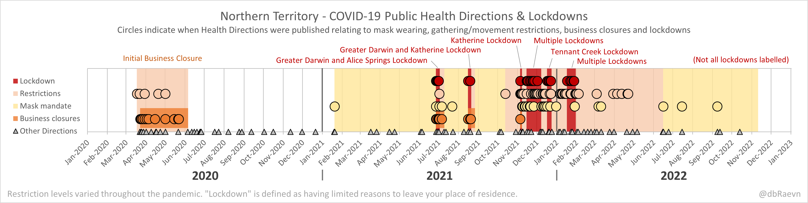

# Australian COVID-19 Pandemic Information

A compilation of datasets, official data sources, reports, outbreak maps and other content I have created related to the COVID-19 pandemic in Australia.

[☕ Support my work](https://www.buymeacoffee.com/dbRaevn)

## Official data sources

[Official COVID-19 data sources](./Datasources.md)

## Official data definitions

[Official COVID-19 data definitions](./Definitions.md)

## Datasets - National

 * AUS - COVID-19 Monthly data [(XLSX)](./AUS_COVID19Data_Monthly.xlsx)
 * AUS - COVID-19 Case data [(XLSX)](./AUS_COVID19Cases.xlsx)
 * AUS - Aged Care [(CSV)](./AUS_AgedCare.csv)

## Datasets - State

 * VIC - Ambulance Code Red events [(CSV)](./VIC/VIC_AmbulanceCodeRed.csv)

## Datasets - Pandemic Directions

| State | Declarations | Directions | Lockdowns | Lockdown Populations |
|---|:-:|:-:|:-:|:-:|
| NT | [CSV](./NT/NT_PublicHealthEmergencyDeclaration.csv) | [CSV](./NT/NT_PandemicDirections.csv) | [CSV](./NT/NT_Lockdowns.csv) | [CSV](./NT/NT_LockdownPopulations.csv) |
| VIC | |  [CSV](./VIC/VIC_PandemicDirections_Partial.csv) (Partial) | | |

## Dataset Guides

For details on definitions and what the data contained within each dataset is, refer to the following guides.

 * [VIC - Dataset guide](./VIC/README.md)
 * [NT - Dataset guide](./NT/README.md)

### Discontinued datasets

 * AUS - COVID-19 data [(XLSX)](./AUS_COVID19Data.xlsx)
 * VIC - Daily COVID-19 Data [(CSV)](./VIC/VIC_DailyData.csv)
 * VIC - Hospitalised COVID-19 cases by age group [(CSV)](./VIC/VIC_HospitalisedByAge.csv)
 * VIC - Cumulative COVID-19 deaths by age group [(CSV)](./VIC/VIC_DeathsByAge.csv)

## Reports (Twitter)

[Australian COVID-19 Reports (Twitter)](./Twitter.md)

## Outbreak Maps

[Australian COVID-19 Outbreak Maps](./OutbreakMaps.md)

## Media references

[In the Media](./Media.md)

<!--
## Charts - COVID-19 Public Health Directions & Lockdowns
Circles indicate when Health Directions were published relating to mask wearing, gathering/movement restrictions, business closures and lockdowns

### NT

## Charts - COVID-19 Directions
Number of Directions published by category, and in effect per month

### NT

-->
